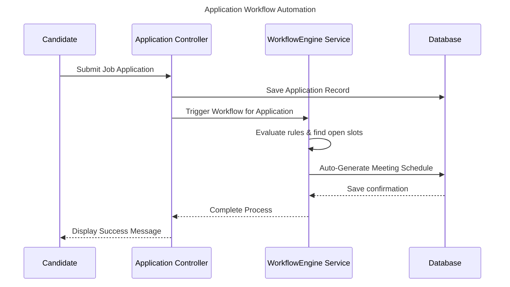
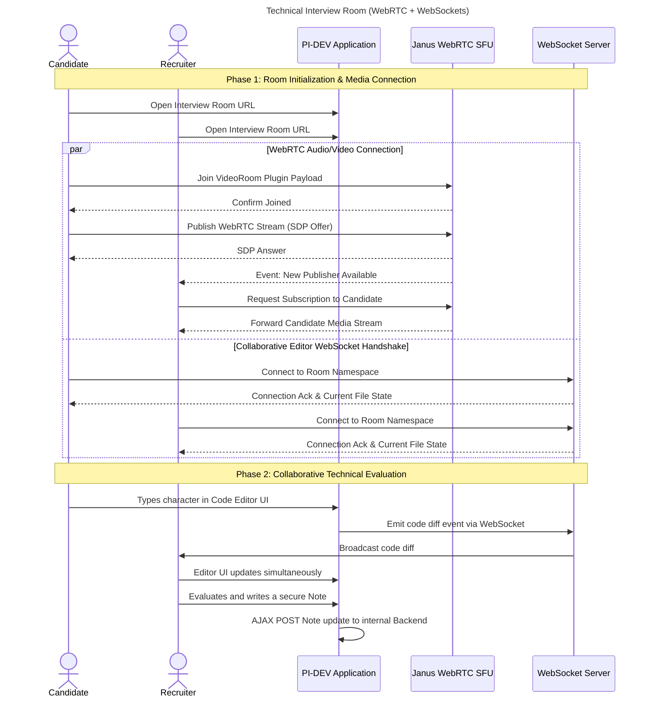
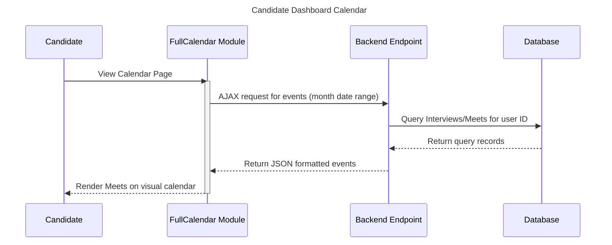
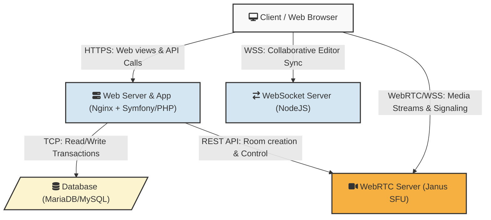

# Project Agile Documentation

## 1. User Stories & Task Breakdown

| ID US | User Story | TASK ID | Task Name | Priority | Estimation | Status |
|-------|---------------------------------------------------------------------------------------------------------------------------------------|---------|--------------------------------------------------------------------------------------------------------|----------|------------|--------|
| **US-01**| As an HR manager, I want to manage (CRUD) interviews so that I can organize the hiring pipeline. | T.1.1 | Create Interview and Meet entities along with database schema. | High | 2h | Done |
| | | T.1.2 | Build the `InterviewController` CRUD methods (`index`, `new`, `show`, `edit`, `delete`). | High | 3h | Done |
| | | T.1.3 | Create Twig templates for Interview management interfaces. | High | 2h | Done |
| | | T.1.4 | Implement Symfony form validations and UI error handling. | Medium | 1h | Done |
| **US-02**| As a recruiter, I want to add notes and numerical grades to an interview so that I can evaluate candidates properly. | T.2.1 | Add specific note-taking and grading properties to the `Interview` database entity. | High | 1h | Done |
| | | T.2.2 | Add grade layout and text input areas to the recruiter's meeting UI Twig template. | Medium | 1h | Done |
| | | T.2.3 | Handle grading submit logic and safely persist evaluation to the backend. | High | 2h | Done |
| **US-03**| As an interviewer/candidate, I want to join a WebRTC video conference with a collaborative code editor for technical interviews. | T.3.1 | Integrate and configure the Janus SFU WebRTC server connected to the backend. | High | 3h | Done |
| | | T.3.2 | Build custom UI for multi-user WebRTC client-side media rendering and negotiations. | High | 3h | Done |
| | | T.3.3 | Integrate a code editing library (like Monaco or CodeMirror). | High | 2h | Done |
| | | T.3.4 | Synchronize code editor state continuously between all peers using WebSockets. | High | 4h | Done |
| **US-04**| As a candidate, I want to view my scheduled interviews in a calendar view so I don't miss them. | T.4.1 | Install and configure the FullCalendar JS library in the frontend infrastructure. | Medium | 1h | Done |
| | | T.4.2 | Build the candidate dashboard layout supporting the FullCalendar components. | Medium | 2h | Done |
| | | T.4.3 | Implement an AJAX controller endpoint fetching the specific user's planned events. | Medium | 2h | Done |
| | | T.4.4 | Map backend database meeting data to FullCalendar native event rendering format. | Medium | 1h | Done |
| **US-05**| As a candidate, I want my interview to be automatically scheduled when I apply for an offer so the process is seamless. | T.5.1 | Implement `WorkflowEngine` service encapsulating automated selection rules. | High | 3h | Done |
| | | T.5.2 | Hook a Doctrine EventListener to `Application` post-persist actions. | High | 1h | Done |
| | | T.5.3 | Automatically locate an available interview time slot using availability constraints matching. | High | 2h | Done |
| | | T.5.4 | Trigger an alert/email notification to candidates highlighting scheduling confirmation. | Low | 1h | Done |
| **US-06**| As a system admin, I want Interview data exposed via an API so that external applications can integrate with us. | T.6.1 | Configure `#[ApiResource]` attributes on relevant `Interview` & `Meet` entities. | Medium | 1h | Done |
| | | T.6.2 | Prepare proper serialization groups for precise security-limited data exposure. | Medium | 1h | Done |
| | | T.6.3 | Configure token-based API authentication constraints and specific scoping. | High | 2h | Done |

---

## 2. Sequence Diagrams per Feature

### Feature: Job Application Workflow Automation (US-05)

### Feature: Video Conference with Collaborative Code Editor (US-03)

### Feature: Fetching Scheduled Interviews Calendar (US-04)

---

## 3. Physical Architecture

